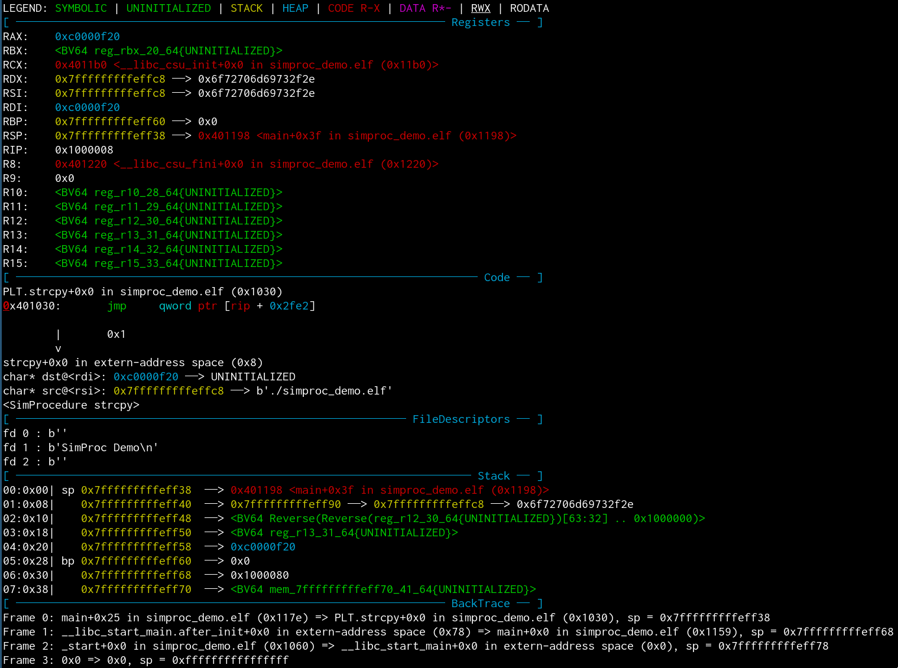
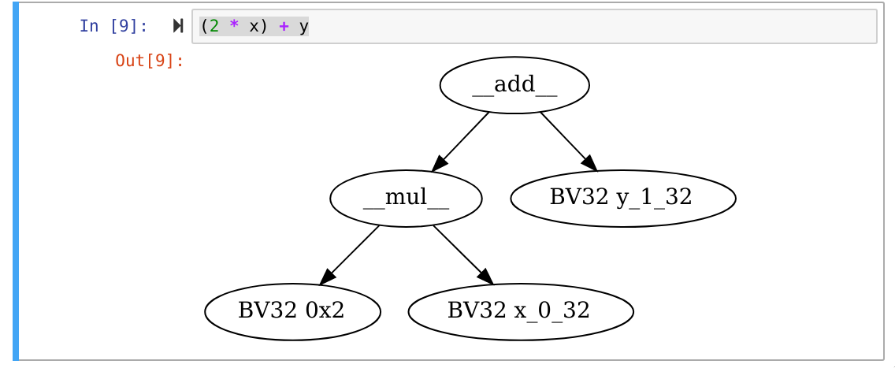

# angr CLI

This Python package is a collection of modules to allow easier interactive use of angr for learning and prototyping angr.

All of the features are designed for the use of angr in an interactive environment like an IPython shell or a Jupyter environment (both CLI and Notebook), but some will still work in a simple Python shell or script.


## Core Features

### State View Plugin

The Context View plugin allows rendering of a state in a view similiar to that provided by GDB plugins like GEF or pwndbg.


#### Usage

```python
import angr
# This line registers the plugin and makes it available on each state
import angrcli.plugins.context_view
proj = angr.Project("/bin/ls", load_options={"auto_load_libs":False})
state = proj.factory.entry_state()

# Print the state
state.context_view.pprint()
```



### Interactive Exploration

The Interactive Exploration is a [Python CMD](https://pymotw.com/2/cmd/) wrapper around a Simulation Manager that provides shortcuts for various common operations, like stepping blocks, running until a symbolic branch or manually selecting successors.

This can either be used in a script, or inside an IPython shell. The latter allows rapid switching between the wrapper to access the shortcuts and the IPython shell for more complex operations.


#### Usage
```python
import angr
import angrcli.plugins.context_view
from angrcli.interaction.explore import ExploreInteractive
proj = angr.Project("/bin/ls", load_options={"auto_load_libs":False})
state = proj.factory.entry_state()
e = ExploreInteractive(proj, state)
e.cmdloop()
```


## Misc

### AST Preview

`angrcli.ast.rendering` provides `render_ast` which uses graphviz to generate a SVG representation of an AST which can be displayed instead of the `__repr__` method of the AST object.

#### Example


```python
import claripy
from angrcli.ast.rendering import render_ast
from claripy.ast.bv import BV
BV._repr_svg_ = lambda self: render_ast(self)._repr_svg_()
x = claripy.BVS('x', 32)
y = claripy.BVS('y', 32)
```

